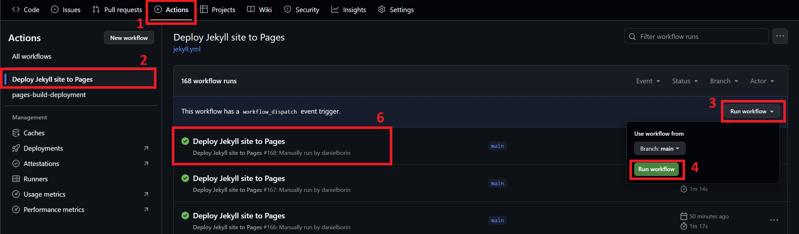

# Site Acadêmico de Daniel Borin

Este é o arquivo fonte que gera o site acadêmico de Daniel Borin. Abaixo estão algumas instruções para atualizar a página quando necessário.

**Observação:** Existe uma versão em inglês deste arquivo `LEIAME.md`, chamada `README.md`.

## 1. Atualizando a Página de Publicações

Quando iniciar um novo ano, a primeira coisa a fazer é ir até os arquivos `Publication.md` e `Publicacoes.md` que estão na pasta `_pages` e editar a lista `years: [2023, 2024, ...]`, adicionando o novo ano.

Para adicionar um novo paper, primeiro faça o upload do arquivo PDF na pasta `papers` e depois insira as informações do paper no arquivo `publist`. Prefira colocar as informações novas no início do documento. A página irá puxar automaticamente as informações do `publist`.

## 2. Adicionando Novo Material de Ensino

Para adicionar um novo curso, siga os seguintes passos:
1. Coloque uma imagem de fundo e uma imagem de logo do curso na pasta `images/Teaching`.
2. Coloque as notas de aula em formato PDF na pasta `lectures_notes`.
3. Em seguida, adicione as informações do curso nos arquivos `Teaching.md` e `Ensino.md` que estão na pasta `_pages`, seguindo o mesmo formato dos outros cursos já adicionados.

## 3. Adicionando uma Nova Página ao Site

Para adicionar uma nova página:
1. Crie dois arquivos `.md`: um para a versão em inglês e outro para a versão em português. Coloque-os na pasta `_pages`.
2. A versão em português deve conter `lang: pt` na sua front matter.
3. Após criar as páginas, edite o arquivo `header.html`. Insira os nomes das páginas em inglês e português na seção de comentários `<!-- Inserir aqui -->`, seguindo o modelo do objeto `<a class=...><a/>` existente.
4. Também edite os comentários `<!-- Edite aqui 1 -->` e `<!-- Edite aqui 2 -->`. Substitua `| replace: '/namept', '/nameenglish'` e `| replace: '/nameenglish', '/namept'`, respectivamente.

Agora sua nova página deve aparecer no site!

## 4. Fazendo o Deploy das Mudanças no GitHub Pages

Após fazer qualquer mudança no site, você deve fazer o deploy do site para o GitHub Pages:

1. Vá até a aba **Actions** no GitHub.
2. Clique em **Deploy Jekyll site to Pages** na seção à esquerda.
3. Em seguida, no lado direito, clique em **Run workflow**.
4. Clique no novo botão **Run workflow** (que aparecerá em verde).
5. Aguarde cerca de 5 minutos para que a ação seja concluída.
6. Verifique se a ação foi bem-sucedida e abra a página para confirmar as mudanças.

Aqui está uma imagem para ilustrar os passos:

Após seguir esses passos, o conteúdo atualizado deverá estar visível no site ao vivo!
